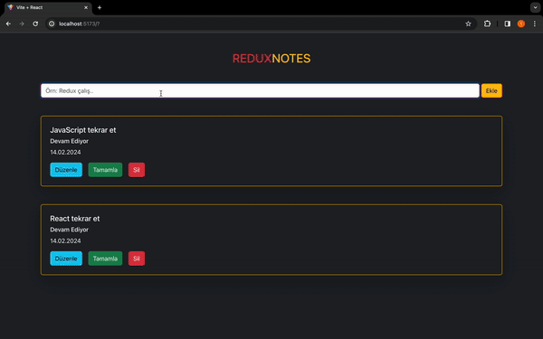

# STATE YÖNETİMİ #

- State: Uygulamadaki bileşenlerimizin sahip olduğu bilgi ve özelliklerdir 

- Prop Drilling: Bileşenlerin yukarıdan aşağıya veri taşıması

- Context API: Uygulamadaki state'i, oluşturduğumuz merkezlerden yönettiğimiz state yönetim aracı

- Redux: Bileşenlerin sahip olduğu ve merkezsi olarak tutulması gereken state'lerin yönetildiği merkezi state yönetim aracı.

# NEDEN REDUX #

- Kod tekrarını önler
- Performası arttırır
- Bileşenh içerisindeki karışıklığı azaltır
- Hata ayıklama daha kolaydır
- Orta ve büyük ölçekli projelerde state'i yönetimi daha kolay hale getirir

# REDUX BİLİNMESİ GEREKENLER #

1) Store: Uygulamanın bütün bileşenleri tarafnda 
erişebilen ve yönetilebilen state deposudur.

2) Reducer: Aksiyondan aldığı talimata göre kısaca aksiyonun tipine göre store'da tuttuğumuz verinin nasıl değişeceğine karar veren fonksiyondur.

3) Action: Storedaki state'i güncellemek için reducer'a gönderdiğimiz emir-haber.
- Action iki değere sahipdir:
           - type: Action'un görevini tanımlayan string ("TODO_EKLE")
           - payload: Gönderilen eylemin verisi

4) Dispatch (Sevketmek): Action'ın gerçekleştiğini reducer'a haber veren metod

5) Subscribe (Abone Olmak): Bileşenlerin store'da tutulan verilere erişimini sağlama(useContext(context tarafı), useSelector(redux tarafı))

6) Provider (Sağlayıcı): Store'da tutulan verileri uygulamaya sağlar

# ÖRNEKLEME #

1) Store: Okulun binası

2) Reducer: Okulun yönetim  (müdür, müdür yrd.)

3) Action: Öğrencinin yeni kayıt yapması, okuldan atılması

4) Dispatch (Sevketmek): Nöb. öğrenci / öğretmen (olayları bildirir)

5) Subscribe (Abone Olmak): E-Okul; verilere erişim sağlar

6) Provider (Sağlayıcı): Okuldaki organizasyon ve hizmet sağlayıcısı, API görevi görür/ bilgileri e-okula aktarır

# REDUX KURULUM AŞAMALARI #

- `Redux`, `React-Redux` paketlerini indir
- reducer/reducer'ların kurulumunu yap
- store'un kurulumunu yap
-store'u projeye tanıt# ReduxNotePad

